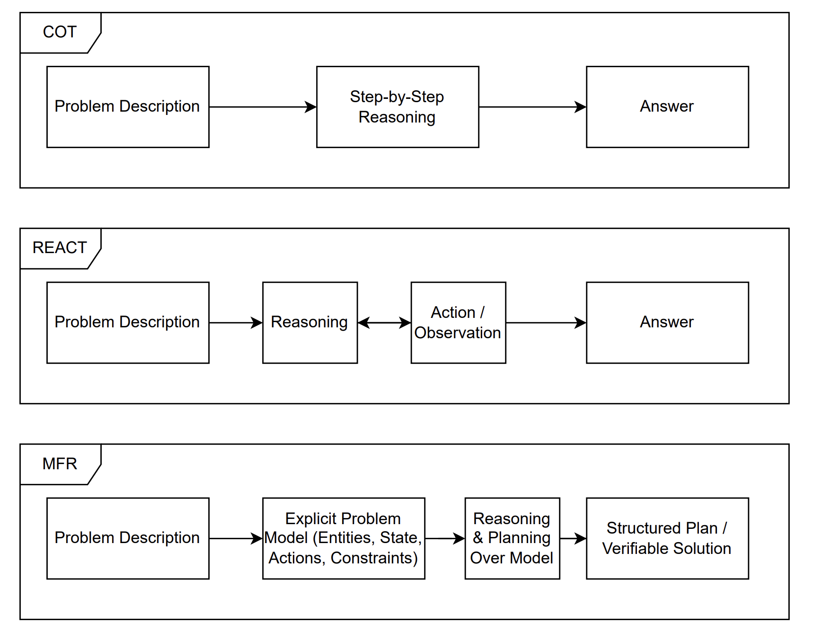

# Problem statement - Analysis of short form videos to generate trends

Design and evaluate an end-to-end, multi-modal pipeline that automatically extracts **fashion and pricing trends** from short-form product videos (e.g., YouTube/Instagram), inspired by the methods in:

https://link.springer.com/article/10.1007/s00521-025-11218-1

The system should jointly analyze audio (speech), visual frames, and on-screen text to detect emerging trends (e.g., "linen shirts under ₹200"), with a focus on **robustness, scalability, and research-grade evaluation** suitable for an M.Tech project.

## Tentative solution and packages

The pipeline is decomposed into stages, each mapped to concrete libraries/models:

| **Stage / Task**            | **Role in pipeline**                                             | **Recommended Library/Model**                |
| --------------------------- | ---------------------------------------------------------------- | -------------------------------------------- |
| **Pipeline Orchestration**  | Download videos, manage steps, export clips/keyframes           | MoviePy or FFmpeg                            |
| **Transcription**           | Generate time-aligned transcript from audio                      | Whisper (local or API)                       |
| **Visual Keyframe Capture** | Extract keyframes around scene changes / product highlights      | OpenCV (e.g., `cv2.absdiff`, SSIM, hist diff) |
| **Visual Understanding**    | Interpret outfits, objects, brand cues from keyframes            | LLaVA or GPT-4V                              |
| **OCR / Logo Detection**    | Read on-screen text, detect brand logos                          | EasyOCR, YOLOv8                              |
| **Trend Graph Construction**| Aggregate entities and prices across many videos into a trend map| NetworkX                                     |
| **Sentiment / Intent**      | Capture sentiment or persuasive tone in speech/text              | TextBlob or VADER                            |

High-level flow:

1. Ingest a batch of videos and extract audio + candidate keyframes.
2. Run Whisper to obtain a timestamped transcript.
3. For each segment, align keyframes with transcript spans (temporal fusion).
4. Apply vision (LLaVA / GPT-4V) + OCR + logo detection to extract products, brands, and prices.
5. Build a graph of products, attributes, and price ranges across videos (NetworkX).
6. Compute simple metrics (frequency, co-occurrence, growth) to identify candidate "trends".

## Future scope

To elevate this from a basic pipeline to a strong M.Tech-level research project:

- **Advanced keyframe extraction**: Replace fixed-interval frames with shot-boundary / semantic-shift detection (histogram difference, SSIM, or transformer-based shot detection) to reduce redundant visual queries.
- **Temporal multi-modal fusion**: Design an explicit alignment layer that reasons jointly over transcript spans + nearby frames, and study how this affects trend detection accuracy.
- **Agentic verification loop**: Add a "search agent" that cross-checks discovered trends against external sources (e.g., YouTube/Google search APIs) to distinguish real trends from noise.
- **Performance metrics & benchmarks**: Create a labeled dataset (e.g., 50–100 videos with manually annotated trends) and report precision/recall/F1 for trend detection and product classification across different model choices (Whisper sizes, LLaVA vs GPT-4V, etc.).
- **Scalability experiments**: Measure runtime and cost as the number of videos and frame queries grow; explore batching, caching, and model distillation strategies.

## Related papers and datasets 
### Analysis of video analysis paper
The following downloaded papers and datasets relevant to Problem statement 1 are stored in the data directory:

- [A Keyframe-Based Approach for Auditing Bias in YouTube Shorts](data/A%20Keyframe-Based%20Approach%20for%20Auditing%20Bias%20in%20YouTube%20Shorts.pdf)
- [Detecting Coordinated Behaviour on Video-First Platforms](data/Detecting%20Coordinated%20Behaviour%20on%20Video-First%20Platforms.pdf)
- [Enrich and Detect: Video Temporal Grounding with Multimodal LLMs](data/Enrich%20and%20Detect-%20Video%20Temporal%20Grounding%20with%20Multimodal%20LLMs.pdf)
- [Global YouTube Trending Dataset (2022–2025): Three Years of Platform Research](data/Global%20YouTube%20Trending%20Dataset%20(2022-2025)-%20Three%20Years%20of%20Platform%20Research.pdf)
- [Higher-Order Vision-Language Alignment for Social Media Prediction](data/Higher-Order%20Vision-Language%20Alignment%20for%20Social%20Media%20Prediction.pdf)
- [HyperFusion: Hierarchical Multimodal Ensemble Learning for Social Media Popularity Prediction](data/HyperFusion-%20Hierarchical%20Multimodal%20Ensemble%20Learning%20for%20Social%20Media%20Popularity%20Prediction.pdf)
- [MVP: Winning Solution to SMP Challenge 2025 Video Track](data/MVP-%20Winning%20Solution%20to%20SMP%20Challenge%202025%20Video%20Track.pdf)
- [SMPV: Social Media Prediction for Videos](data/_SMPV-%20Social%20Media%20Prediction%20for%20Videos.pdf)
- [SMP Challenge Summary: Social Media Prediction Challenge](data/_SMP%20Challenge%20Summary-%20Social%20Media%20Prediction%20Challenge.pdf)
- [FAME: Fusion-Aware Multi-modal Ensemble for Social Media Popularity Prediction](data/_FAME-%20Fusion-Aware%20Multi-modal%20Ensemble%20for%20Social%20Media%20Popularity%20Prediction.pdf)
- [TVSum: Summarizing Web Videos Using Titles](data/TVSum_Summarizing_web_videos_using_titles.pdf)
- [Unsupervised Video Summarization with Adversarial LSTM Networks](data/Unsupervised_Video_Summarization_with_Adversarial_LSTM_Networks.pdf)
- [TimeLens: Rethinking Video Temporal Grounding with Multimodal LLMs](data/TimeLens-%20Rethinking%20Video%20Temporal%20Grounding%20with%20Multimodal%20LLMs.pdf)
- [Video Understanding with Large Language Models: A Survey](data/Video%20Understanding%20with%20Large%20Language%20Models-%20A%20Survey.pdf)
- [Global YouTube Trending Dataset – SMPDVideo](data/SMPDVideo.zip)
- [ConnectedPapers BibTeX for MVP Paper](data/ConnectedPapers-for-MVP%3A-Winning-Solution-to-SMP-Challenge-2025-Video-Track.bib)
- [Linen Shirts under 200 – Example Source Video](data/Linen%20Shirts%20under%20200%20#linenfashion%20#linenclothing%20#linenshirts%20#myntrashirt%20#mensfashion%20#meesho%20-%20Khanstyling%20(720p,%20h264,%20youtube).mp4)
- [Book/Reference 1](data/978-3-030-72610-2.pdf)
- [Book/Reference 2](data/978-3-031-43078-7.pdf)

### Analysis of Agentic AI papers

1. Problem - Evaluation of reasoning/planning capabilities of LLM 
	1. Solution - PlanBench
	2. https://arxiv.org/pdf/2206.10498
2. Problem - LLMs show promise in leveraging external tools. But planning consumes large amount of tokens. 
	1. Solution - During post training, DEEPPLANNER uses token-level advantage with an entropy-based term to allocate larger updates to high entropy tokens, and selectively upweights sample-level advantages for planning-intensive rollouts. 
	2. They dont just do supervised fine tuning, SFT, but use RL based fine tuning. 
	3. https://arxiv.org/pdf/2510.12979
	4. https://github.com/AlexFanw/DeepPlanner/blob/main/user/train.sh
3. Problem - Long term context is missing. LLMs should be able to hold conversational systems for long term interactions and tasks. Proactiveness in LLMs are missing. They do not ask questions about you when you ask "Plan a travel".
	1. Solution - Uses meta prompt, the macro-actions are instantiated to "ask a question", "add a step", or "alter a step", so that the AI agent can operate in a similar fashion as a person would if they were to be asked to help with coaching or tutoring or assisting with making a plan. 
	2. https://arxiv.org/pdf/2502.19500
4. Problem - Due to bad reasoning, the LLMs face issue during complex planning problems. 
	1. Solution - PlanGen. Three agents - planning agent, constraint agent and verification agent. 
	2. https://arxiv.org/pdf/2502.16111
5. Problem - Long term plan is not possible for LLM. 
	1. Solution - Feedback aware fine tuning (FAFT) vs Supervised Fine Tuning (SFT), why FAFT is better
	2. https://arxiv.org/pdf/2408.06318
6. Problem - Gaming related parameterized skills, can LLM work
	1. Solution - Skill library, skill planner and skill executor implement PLAP in MicroRTS
	2. https://arxiv.org/pdf/2509.13127
7. Problem - Increasing context of LLM
	1. Solution - Instead of RAG, we use Recursive Language Model. LLM spaws sub child to find the right data. It can be script or it can be something else. 
	2. https://arxiv.org/pdf/2512.24601
8. Problem - COT and REACT has shown good capabilities in LLM for reasoning, but still there is issues. Issues like constraint violations, inconsistent state tracking, and brittle solutions that break under minor changes
	1. Solution - Model First Reasoning. Error arises from inconsistent models. Hallucination is not merely the generation of false statements. Rather, it is a symptom of reasoning performed without a clearly defined model of the problem space.
	2. 
	3. https://arxiv.org/pdf/2512.14474
9. Problem - LLMs suffer from halliculations, outdated knowledge, high training and inference cost.  
	1. Solution - Survery of all methods
	2. https://arxiv.org/pdf/2508.17692